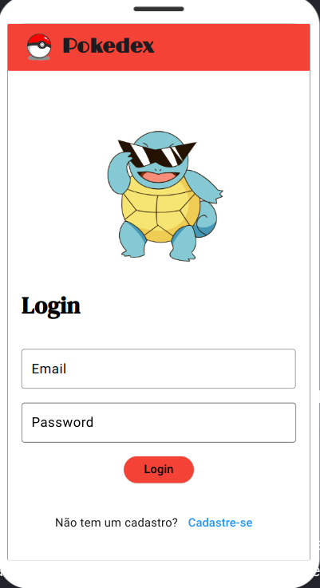
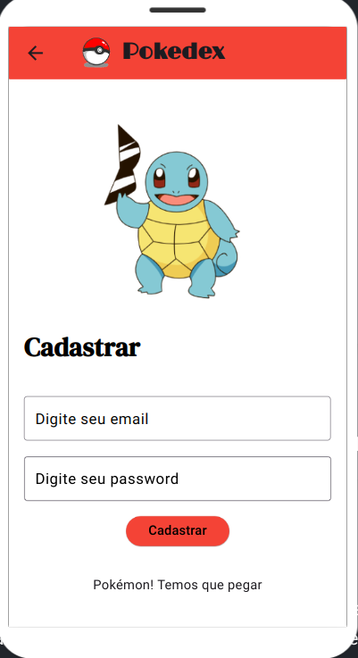
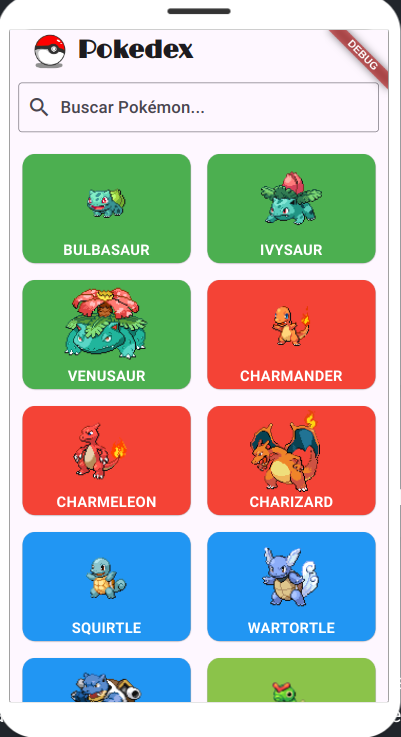

# 📱 Pokedex Flutter

Este projeto é uma **Pokedex** desenvolvida em **Flutter**, que integra dados de uma API pública de Pokémon e utiliza o **Firebase** para autenticação de usuários.

## 🚀 Funcionalidades

- Tela de login e cadastro utilizando **Firebase Authentication**.
- Listagem de Pokémons consumindo dados de uma API externa.

## 🛠️ Tecnologias Utilizadas

- Flutter (Dart)
- Firebase Authentication
- PokéAPI

## ⚙️ Como Rodar o Projeto

1. Clone o repositório:

```bash
git clone https://github.com/caiotaveiraa/pokedex.git
```

2. Acesse a pasta do projeto:

```bash
cd pokedex
```

3. Instale as dependências:

```bash
flutter pub get
```

4. Execute o projeto:

```bash
flutter run
```

## 📱 Prints da Aplicação na Versão Mobile

| Tela de Login | Tela de Cadastro | Lista de Pokémons | Pesquisa na Lista de Pokémons |
|:-------------:|:----------------:|:-----------------:|:-----------------:|
|  |  |  |  |

## 💻 Prints da Aplicação na Versão Web

| Tela de Login | Tela de Cadastro | Lista de Pokémons |
|:-------------:|:----------------:|:-----------------:|
|  |  |  |

## 📦 Link para Testar

- 🔗 [Clique aqui para baixar o APK ou acessar a versão web](link_para_o_apk_ou_web)

---

## 👨‍🎓 Desenvolvido por

**Caio Taveira - 23947**